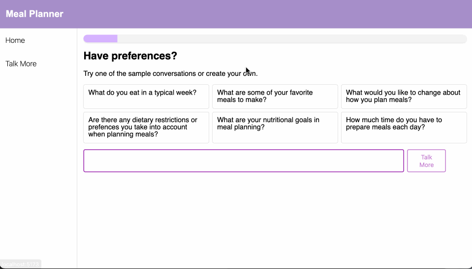

# Meal Planner

This is an app which takes in user preferences for how they plan meals, and then generates meal plans.

# Quick Start

1. If you don't already have `node`, we recommend installing [nvm](https://github.com/nvm-sh/nvm).
2. Run `npm install` to install dependencies.
3. Run `npm run dev` to see the app running at [localhost:5173](http://localhost:5173).
