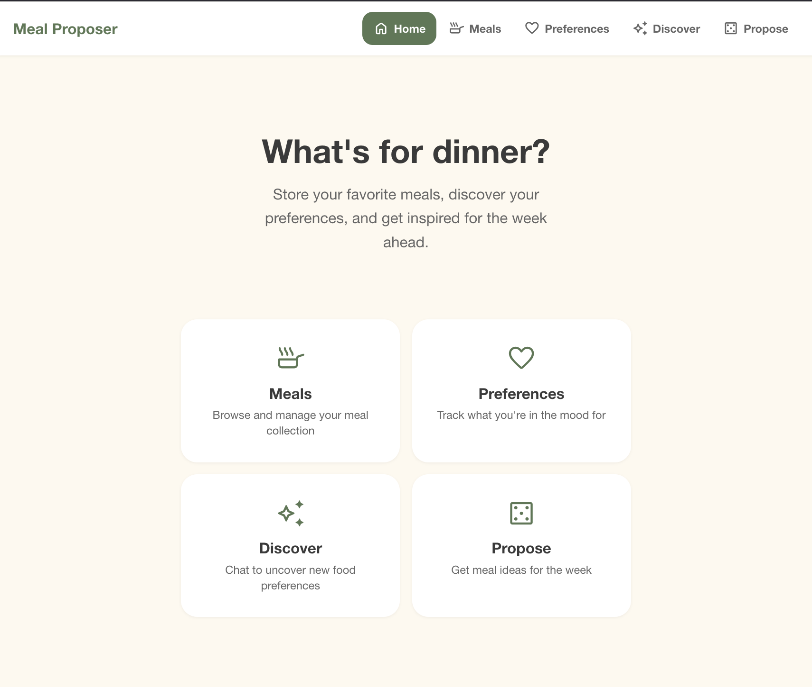

# Meal Proposer

A personal meal planning app that helps you discover, save, and get suggestions for meals based on your food preferences. Built with Svelte5 and Storybook.

This project is mostly written with Claude Code.



## Features

- **Meals** -- Save and manage your meal collection with tags and notes
- **Preferences** -- Store food preferences as short text snippets with tags
- **Discover** -- Walk through a guided questionnaire that helps you articulate new food preferences
- **Propose** -- Get meal suggestions from your saved meals (random pick) or automatically generated ideas, with explicit control over which preferences are sent to the LLM

## Setup

```sh
npm install
```

### Environment variables

The app connects to an OpenAI-compatible chat completions API. Set these before running:

| Variable   | Default                      | Description                        |
| ---------- | ---------------------------- | ---------------------------------- |
| `ENDPOINT` | `https://api.openai.com/v1`  | Base URL for the completions API   |
| `API_KEY`  | (none)                       | Bearer token for the API           |
| `MODEL`    | `gpt-5-mini`                 | Model name to use for completions  |

## Development

```sh
npm run dev
```

## Testing

```sh
# Run all tests (unit + storybook component tests)
npm test

# Watch mode
npm run test:unit

# Storybook dev server
npm run storybook
```

Storybook tests include axe-core accessibility checks configured to fail on violations.

## Build

```sh
npm run build
npm run preview
```

Uses `@sveltejs/adapter-node` for deployment.

